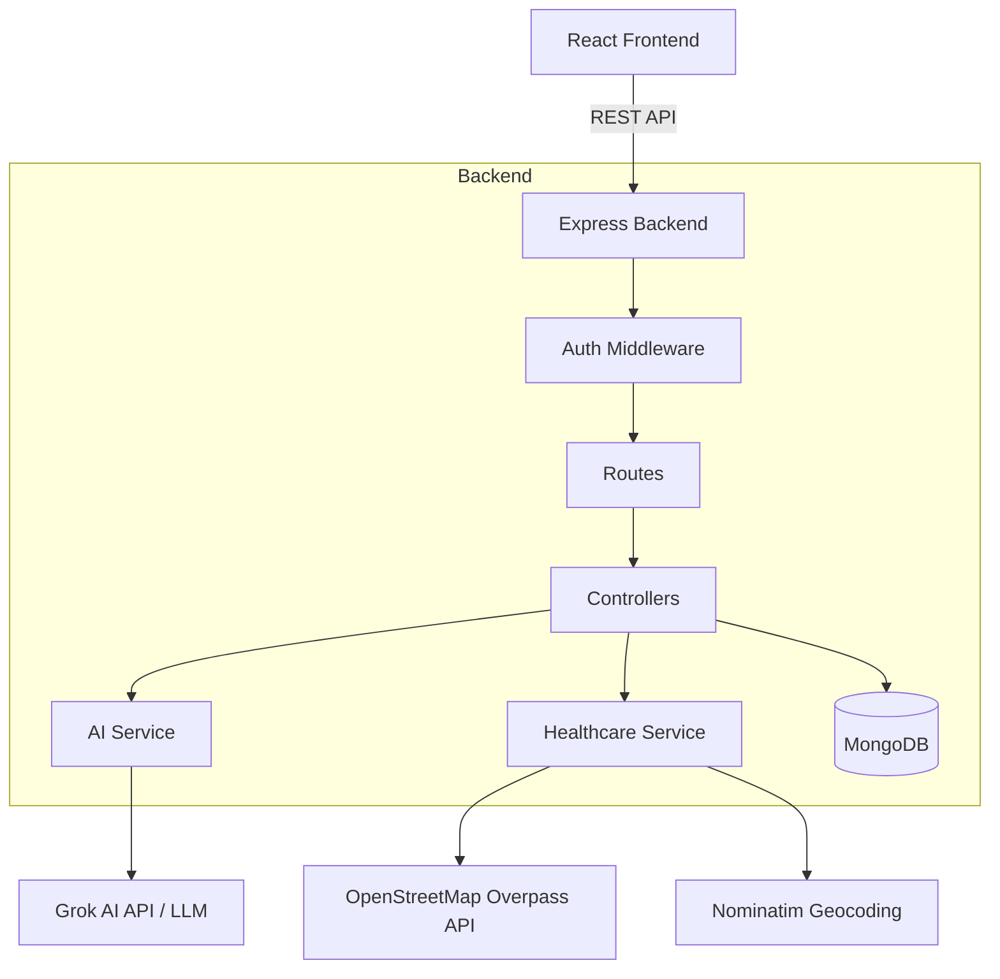

# MediGuide AI 🩺

> Understand your symptoms. Find the right care.

MediGuide AI is an AI-assisted healthcare information and nearby healthcare discovery platform. Built with the MERN stack (MongoDB, Express.js, React, Node.js), this platform aims to provide general health information based on user-provided symptoms and helps users find nearby hospitals and clinics using OpenStreetMap.

---

## 🚀 Features

- **Conversational Symptom Checker**: Interact with an AI assistant to describe symptoms and receive structured informational insights.
- **Safety First**: Deterministic emergency keyword screening intercepts life-threatening keywords (e.g., "severe chest pain") and bypasses the AI to recommend immediate professional care.
- **Geospatial Healthcare Finder**: Locate nearby hospitals and clinics utilizing the browser Geolocation API and OpenStreetMap's Overpass API.
- **Interactive Map**: Visualize nearby facilities on an interactive map built with Leaflet.
- **Health History Dashboard**: Save, view, and manage past symptom reports.
- **Voice Input Integration**: Speak your symptoms directly using the browser's Web Speech API.
- **Privacy Controls**: Complete control over your data. Delete individual reports or permanently delete your entire account and history.
- **JWT Authentication & Authorization**: Secure, role-based access control (User/Admin).
- **Responsive UI**: Modern, clean, accessible interface built with Tailwind CSS.

---

## 📸 Architecture

This project strictly adheres to a decoupled Service-Controller-Route architecture on the backend, abstracting third-party integrations for maintainability.



## 🛠️ Tech Stack

### Frontend
- **Framework**: React 19 + Vite
- **Styling**: Tailwind CSS v4
- **Routing**: React Router v7
- **Maps**: Leaflet + React-Leaflet
- **Icons**: Lucide React
- **HTTP Client**: Axios

### Backend
- **Runtime**: Node.js
- **Framework**: Express.js
- **Database**: MongoDB + Mongoose
- **Authentication**: JWT (JSON Web Tokens)
- **Security**: bcryptjs, Helmet, CORS, Express Validator

### External APIs (100% Free & Open Source)
- **AI**: Grok API (Abstracted Provider, replaceable with local Ollama or Gemini)
- **Geocoding**: Nominatim
- **Facility Data**: OpenStreetMap Overpass API

---

## 💻 Installation & Running Locally

### Prerequisites
- Node.js (v18+ recommended)
- MongoDB (Local instance or MongoDB Atlas free tier URI)

### 1. Clone the repository
```bash
git clone https://github.com/yourusername/mediguide-ai.git
cd mediguide-ai
```

### 2. Backend Setup
```bash
cd backend
npm install
```

Create a `.env` file in the `backend` directory (refer to `.env.example`):
```env
PORT=5000
NODE_ENV=development
MONGO_URI=mongodb://localhost:27017/mediguide
JWT_SECRET=your_super_secret_jwt_key
JWT_EXPIRES_IN=7d
AI_PROVIDER=grok
AI_API_KEY=your_grok_api_key
FRONTEND_URL=http://localhost:5173
```

Start the backend server:
```bash
node server.js
# Or use nodemon for development: npm run dev
```

### 3. Frontend Setup
```bash
cd ../frontend
npm install
```

Start the Vite development server:
```bash
npm run dev
```

The application will be available at `http://localhost:5173`.

---

## 🔒 Security & Privacy
- Passwords are cryptographically hashed using `bcryptjs` before storage.
- All protected endpoints require a valid JWT passed via the `Authorization: Bearer <token>` header.
- Users can only access and delete their own symptom reports.
- Account deletion removes all associated user data and symptom history from the database completely.

---

## ⚠️ Medical Disclaimer

**IMPORTANT: MediGuide AI is not a doctor.**
This tool provides general health information and does not provide medical diagnosis. It is not a substitute for professional medical advice, diagnosis, or treatment. Always seek the advice of your physician or other qualified health provider with any questions you may have regarding a medical condition. 

If you think you may have a medical emergency, call your doctor, go to the emergency department, or call emergency services immediately.

---

## 🌐 Deployment
- **Frontend**: Designed to be deployed on Vercel, Netlify, or any static hosting provider.
- **Backend**: Can be hosted on Render, Railway, Fly.io, or any Node.js compatible environment.
- **Database**: MongoDB Atlas Free Tier is fully supported.

---

## 📈 Future Improvements
- **Admin Dashboard UI**: A dedicated React interface to visualize the aggregate metrics served by `/api/admin/stats`.
- **Localization (i18n)**: Support for multiple languages for the symptom checker.
- **Offline Support**: PWA integration for accessing saved reports without an internet connection.
